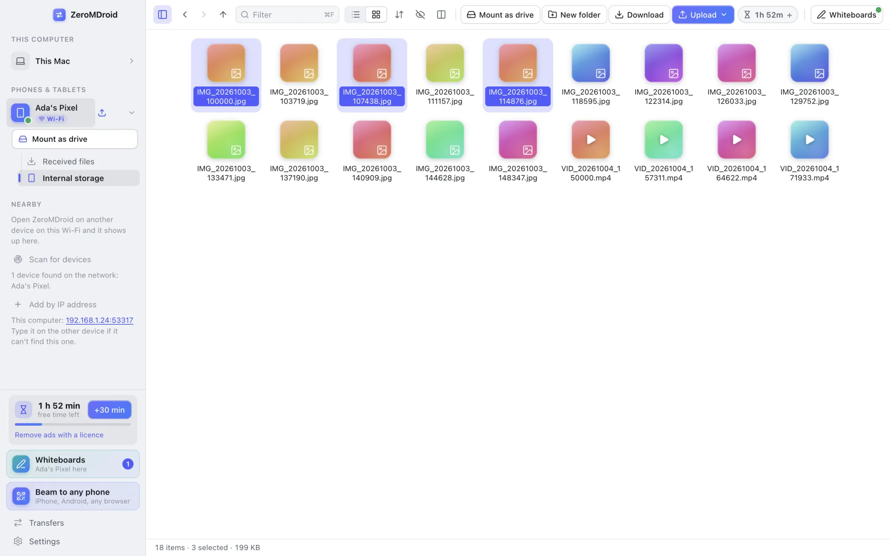
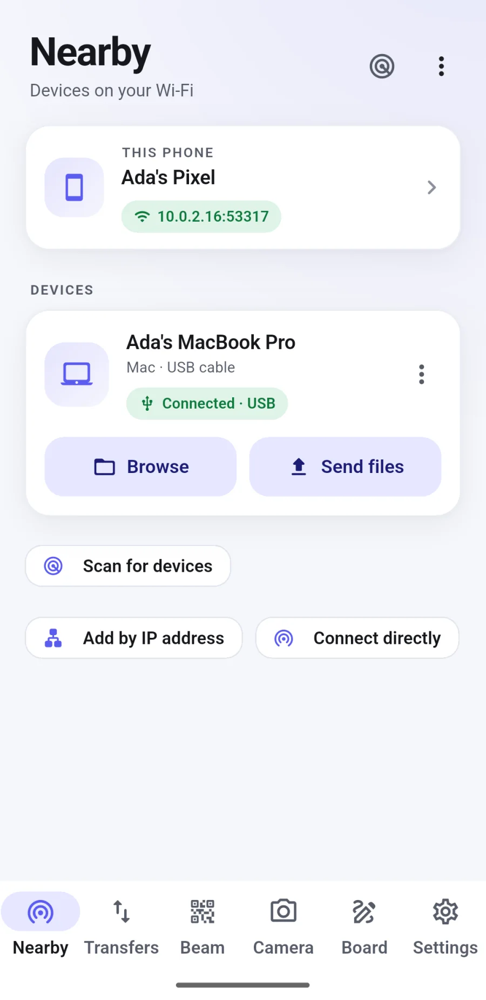
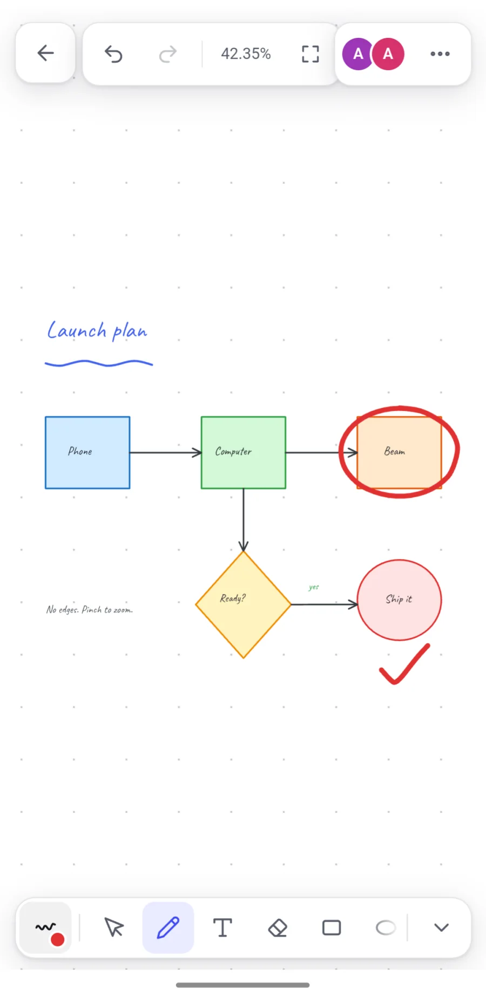
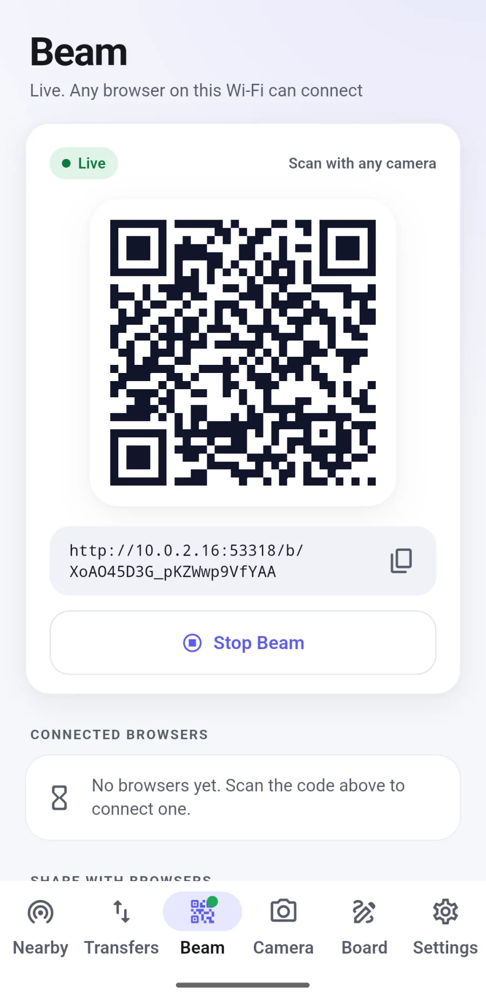
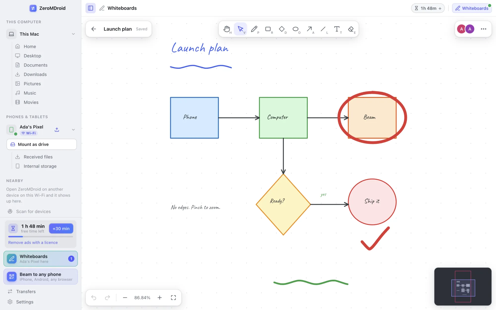

<h1 align="center">ZeroMDroid</h1>

<b>Your files, wherever you are.</b> 
Move files between your phone and your computer over Wi-Fi, USB or a QR code, and draw together on shared whiteboards. 
No account · No cloud · Nothing leaves your network

<a href="#download"><b>Download</b></a> ·
<a href="https://zeromdroid.fabrixly.com">Website</a> ·
<a href="https://zeromdroid.fabrixly.com/guide">How to use it</a> ·
<a href="https://zeromdroid.fabrixly.com/licence">Pro licence</a> ·
<a href="https://zeromdroid.fabrixly.com/privacy">Privacy</a> ·
<a href="https://zeromdroid.fabrixly.com/terms">Terms</a>

<picture><source media="(prefers-color-scheme: dark)" srcset="docs/img/desktop-files-dark.webp"></picture>

<picture><source media="(prefers-color-scheme: dark)" srcset="docs/img/phone-nearby-dark.webp"></picture> <picture><source media="(prefers-color-scheme: dark)" srcset="docs/img/phone-board-dark.webp"></picture> <picture><source media="(prefers-color-scheme: dark)" srcset="docs/img/phone-beam-on-dark.webp"></picture>

---

## Download

**ZeroMDroid 1.1.0**: free with ads; a Pro licence removes the ads and the time limit. This repository only gives away the apps; the files are attached to the
[**v1.1.0 release**](https://github.com/Avinashkumar8694/ZeroMDroid-Apps/releases/tag/v1.1.0). Press a link and the download starts.

#### macOS

| For | What | Download | Size |
|---|---|---|---|
| **Apple silicon (M1 and newer)** | Disk image | [ZeroMDroid-1.1.0-mac-arm64.dmg](https://github.com/Avinashkumar8694/ZeroMDroid-Apps/releases/download/v1.1.0/ZeroMDroid-1.1.0-mac-arm64.dmg) | 115 MB |
| Intel | Disk image | [ZeroMDroid-1.1.0-mac-x64.dmg](https://github.com/Avinashkumar8694/ZeroMDroid-Apps/releases/download/v1.1.0/ZeroMDroid-1.1.0-mac-x64.dmg) | 122 MB |
| Apple silicon (M1 and newer) | Zip | [ZeroMDroid-1.1.0-mac-arm64.zip](https://github.com/Avinashkumar8694/ZeroMDroid-Apps/releases/download/v1.1.0/ZeroMDroid-1.1.0-mac-arm64.zip) | 115 MB |
| Intel | Zip | [ZeroMDroid-1.1.0-mac-x64.zip](https://github.com/Avinashkumar8694/ZeroMDroid-Apps/releases/download/v1.1.0/ZeroMDroid-1.1.0-mac-x64.zip) | 121 MB |

#### Windows

| For | What | Download | Size |
|---|---|---|---|
| **64-bit Intel / AMD (most PCs)** | Installer | [ZeroMDroid-Setup-1.1.0-x64.exe](https://github.com/Avinashkumar8694/ZeroMDroid-Apps/releases/download/v1.1.0/ZeroMDroid-Setup-1.1.0-x64.exe) | 103 MB |
| ARM64 (Snapdragon, Windows on ARM) | Installer | [ZeroMDroid-Setup-1.1.0-arm64.exe](https://github.com/Avinashkumar8694/ZeroMDroid-Apps/releases/download/v1.1.0/ZeroMDroid-Setup-1.1.0-arm64.exe) | 97.0 MB |
| both kinds in one installer (larger) | Installer | [ZeroMDroid-Setup-1.1.0.exe](https://github.com/Avinashkumar8694/ZeroMDroid-Apps/releases/download/v1.1.0/ZeroMDroid-Setup-1.1.0.exe) | 200 MB |
| ARM64 (Snapdragon, Windows on ARM) | Zip | [ZeroMDroid-1.1.0-win-arm64.zip](https://github.com/Avinashkumar8694/ZeroMDroid-Apps/releases/download/v1.1.0/ZeroMDroid-1.1.0-win-arm64.zip) | 140 MB |
| 64-bit Intel / AMD (most PCs) | Zip | [ZeroMDroid-1.1.0-win-x64.zip](https://github.com/Avinashkumar8694/ZeroMDroid-Apps/releases/download/v1.1.0/ZeroMDroid-1.1.0-win-x64.zip) | 142 MB |

#### Linux

| For | What | Download | Size |
|---|---|---|---|
| **64-bit Intel / AMD** | AppImage | [ZeroMDroid-1.1.0-linux-x86_64.AppImage](https://github.com/Avinashkumar8694/ZeroMDroid-Apps/releases/download/v1.1.0/ZeroMDroid-1.1.0-linux-x86_64.AppImage) | 123 MB |
| ARM64 (Raspberry Pi 4+, ARM servers) | AppImage | [ZeroMDroid-1.1.0-linux-arm64.AppImage](https://github.com/Avinashkumar8694/ZeroMDroid-Apps/releases/download/v1.1.0/ZeroMDroid-1.1.0-linux-arm64.AppImage) | 124 MB |
| ARM64 (Raspberry Pi 4+, ARM servers) | Debian / Ubuntu package | [ZeroMDroid-1.1.0-linux-arm64.deb](https://github.com/Avinashkumar8694/ZeroMDroid-Apps/releases/download/v1.1.0/ZeroMDroid-1.1.0-linux-arm64.deb) | 93.8 MB |
| 64-bit Intel / AMD | Debian / Ubuntu package | [ZeroMDroid-1.1.0-linux-amd64.deb](https://github.com/Avinashkumar8694/ZeroMDroid-Apps/releases/download/v1.1.0/ZeroMDroid-1.1.0-linux-amd64.deb) | 98.7 MB |
| ARM64 (Raspberry Pi 4+, ARM servers) | Archive | [ZeroMDroid-1.1.0-linux-arm64.tar.gz](https://github.com/Avinashkumar8694/ZeroMDroid-Apps/releases/download/v1.1.0/ZeroMDroid-1.1.0-linux-arm64.tar.gz) | 118 MB |
| 64-bit Intel / AMD | Archive | [ZeroMDroid-1.1.0-linux-x64.tar.gz](https://github.com/Avinashkumar8694/ZeroMDroid-Apps/releases/download/v1.1.0/ZeroMDroid-1.1.0-linux-x64.tar.gz) | 117 MB |

#### Android

| For | What | Download | Size |
|---|---|---|---|
| **Android 7.0 or newer** | App (.apk) | [ZeroMDroid-1.1.0-android.apk](https://github.com/Avinashkumar8694/ZeroMDroid-Apps/releases/download/v1.1.0/ZeroMDroid-1.1.0-android.apk) | 69.9 MB |

Not sure? On a Mac, **Apple menu → About This Mac**: a chip named *Apple M…* means Apple silicon, otherwise Intel. On Windows 10/11 most PCs are 64-bit Intel / AMD. The
iPhone app is built but not released yet: an iPhone can already trade files with any ZeroMDroid computer through **Beam** (scan the QR code with the camera, no app needed).

**Check your download** (optional): every file's SHA-256 is in [`SHA256SUMS`](SHA256SUMS) and [`manifest.json`](manifest.json). In a terminal, in the folder with the file:
`shasum -a 256 -c SHA256SUMS --ignore-missing` (macOS, Linux) or `certutil -hashfile <file> SHA256` (Windows).

## Install

* **macOS:** open the `.dmg`, drag *ZeroMDroid* to *Applications*. The app is not signed with a paid Apple certificate yet, so the first time: right-click the app → **Open** → **Open**
  (or *System Settings → Privacy & Security → Open Anyway*). macOS asks once to let ZeroMDroid see your Desktop, Documents and Downloads folders (and, for a pendrive, *Removable Volumes*): choose **Allow**.
* **Windows:** run the `Setup` installer. If SmartScreen says it protected your PC, choose **More info → Run anyway** (the installer is not signed with a paid certificate yet). Allow ZeroMDroid on *private networks* when Windows Firewall asks.
* **Linux:** *AppImage:* `chmod +x ZeroMDroid-*.AppImage` and run it. *Debian / Ubuntu:* `sudo apt install ./ZeroMDroid-*.deb`. *Archive:* unpack it anywhere and run `ZeroMDroid`.
* **Android:** open the `.apk` on the phone and allow installing from your browser or file manager when Android asks. *Play Protect* may offer to scan it: that is fine.

Older versions stay where they are: every one has its own page under [**Releases**](https://github.com/Avinashkumar8694/ZeroMDroid-Apps/releases).

## Use it

1. **Install** ZeroMDroid on the computer and on the phone. (An Android phone on a USB cable does not even need the phone app: plug it in, allow USB debugging, and click *Set up Android bridge* once.)
2. **Pair** once: open ZeroMDroid on both, press *Pair* and accept when the **same 6-digit code** shows on both screens.
3. **Move files:** browse the phone like a folder, drag and drop, or pick photos and press send. Big transfers run in the background with live speed and time left.

No cable and nothing to install on the other side? Use **Beam**: show the QR code, scan it with any phone's camera, approve it on your screen, and trade files through the phone's browser (iPhone included).

## What it does

* **Browse another device like a folder**: its storage next to yours, drag and drop, two panes, open files with any app, pendrives and SD cards too.
* **Wi-Fi, USB or QR code**: whichever is at hand; the same app and the same look on every system.
* **Big files, calmly**: live speed, pause and resume, safe writes (a cancelled transfer never leaves half a file).
* **Camera to computer**: shoot on the phone and the photo lands on the computer.
* **Shared whiteboards**: endless boards that every paired device draws on at the same time, live.
* **Mount a phone as a drive** (macOS), a command palette (⌘K), dark and light themes.

<picture><source media="(prefers-color-scheme: dark)" srcset="docs/img/desktop-board-dark.webp"></picture>

## Free with ads, and Pro

ZeroMDroid is free: it starts with some free time (a little more each day), watching a short message adds more, and a **Pro licence** removes the ads and the limit for good. A licence is
monthly, yearly or lifetime and is kept under your **e-mail address**: ask in the app (*Ask for a licence*) or at [zeromdroid.fabrixly.com/licence](https://zeromdroid.fabrixly.com/licence), tell us what you need, and we send the key. It can
be for several devices and can be moved to a new phone. **No account, and no data collected: your minutes stay on your device.** Details: [privacy policy](https://zeromdroid.fabrixly.com/privacy), [terms](https://zeromdroid.fabrixly.com/terms).

## Help

* How-to guide and FAQ: [zeromdroid.fabrixly.com/guide](https://zeromdroid.fabrixly.com/guide)
* Something wrong, or a question: **admin@fabrixly.com**
* Wrong picture of the app, a link that does not work? Open an issue in this repository.

© Fabrixly. ZeroMDroid 1.1.0. The builds in this repository's releases are the same files the website gives away; compare the checksums if in doubt.
